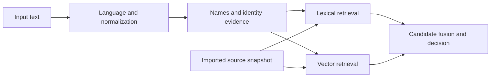

# Multilingual Sanctions Search

[](https://github.com/dariapavlova02/multilingual-sanctions-search/actions/workflows/ci.yml)
[](https://www.python.org/)
[](LICENSE)

Multilingual entity search over sanctions lists, built with FastAPI, Elasticsearch
and NLP models. The pipeline normalizes English, Russian and Ukrainian names,
retrieves lexical and vector candidates, and preserves the source evidence behind
each match.

[Architecture](docs/ARCHITECTURE.md) · [API](docs/API.md) · [Run locally](docs/DEPLOYMENT.md) · [Tests](docs/TESTING.md) · [Data](docs/DATA_PROVENANCE.md)

Version [v0.1.0](https://github.com/dariapavlova02/multilingual-sanctions-search/tree/v0.1.0) · Local research reference

## Quick start

Requires Docker with Compose v2, Python 3, and at least 4 GB allocated to Docker.
The first build downloads the pinned language and embedding models.

```bash
git clone https://github.com/dariapavlova02/multilingual-sanctions-search.git
cd multilingual-sanctions-search
python3 scripts/create_local_env.py
docker compose build
docker compose up -d elasticsearch provision
docker compose run --rm -T \
  -v "$PWD/examples/demo:/demo:ro" --entrypoint python ai-service \
  -m ai_service.scripts.bootstrap --ingest --vectors --data-dir /demo --batch-size 16
docker compose up -d ai-service
```

This small example loads [three fictional entities](examples/demo/README.md):
John Smith, Іван Петренко and Example Trading LLC. They illustrate name and alias
retrieval and do not describe sanctioned people or companies. The repository's
historical sanctions snapshots are separate; see [loading your data](docs/DEPLOYMENT.md#load-a-snapshot).

After model startup, check readiness and run a query:

```bash
curl --fail http://127.0.0.1:8001/health/ready
curl --fail http://127.0.0.1:8001/search \
  -H 'Content-Type: application/json' \
  -d '{"query":"John A. Smith","search_mode":"ac","top_k":10}'
```

The query retrieves source entity `demo-person-1` through its alias. Interactive
API documentation is at `http://127.0.0.1:8001/docs`. On subsequent starts, use
`docker compose up -d`; the importer refuses to overwrite a nonempty snapshot
without `--replace`. `docker compose down` stops services and preserves data volumes.

## How it works



- **Normalization:** Unicode cleanup, language-specific morphology, initials and
  name variants, with spans mapped back to the original text.
- **Retrieval:** exact, phrase, ngram, fuzzy and vector search over an explicitly
  imported snapshot. Embeddings use a pinned multilingual MiniLM model.
- **Identity:** aliases merge by source, entity type and source ID; dates and
  identifiers remain associated with their source spans.
- **Consistency:** incomplete imports, backend failures and incompatible index
  generations make screening unavailable. Scores retain match evidence for review.

Implementation contracts and code entry points are in [Architecture](docs/ARCHITECTURE.md).

## Verification

Recorded local reference run: Python 3.12 / macOS ARM64, with Elasticsearch
in Docker. These are engineering checks, not search-quality metrics.

| Check | Result |
| --- | --- |
| Maintained reference suite | 1,739 passed; 2 optional FAISS checks skipped |
| Complete test collection | 3,883 cases collected |
| Real-model HTTP workflows | Ingestion, aliases, lexical/vector/hybrid retrieval and replacement protection passed |
| Packaging and configuration | Wheel/sdist build and all three Compose configurations passed |

```bash
poetry install --with dev
make check
```

`make check` runs the explicit [reference selection](tests/reference_suite.txt)
with real models and disposable Elasticsearch, checks documentation, collects all
tests, builds the package and validates Compose. The broader research suite has
unresolved failures; run it with `make test-all`. [Testing](docs/TESTING.md)
describes the scope and the recorded baseline.

## Project status and limitations

- The system was originally developed for commercial use, but the project was
  discontinued before production deployment. This repository is an open-source
  adaptation of that work for reproducible local evaluation.
- Formal precision, recall and false-positive benchmarking was not completed.
  It requires a representative labeled dataset aligned with the intended operating
  domain and was not pursued after commercial development stopped. Ranking and risk
  scores are not probabilities.
- The bundled historical snapshots were collected from publicly accessible official
  Ukrainian government websites. They support reproducibility, but should not be
  treated as a current sanctions feed.
- Name morphology, ambiguous aliases and identifier ownership still contain cases
  that would require broader domain evaluation.
- Production operation, multi-host coordination and disaster recovery were never
  validated. Historical image advisories are disclosed in [Security](SECURITY.md).

## Data and models

[Data provenance](docs/DATA_PROVENANCE.md) records the bundled snapshots and their
checksums. The [embedding manifest](src/ai_service/data/config/embedding_model.json)
and [spaCy requirements](requirements-models.txt) pin the model artifacts used by
local setup and Docker.

The source code is [MIT-licensed](LICENSE). Third-party datasets and models retain
their own terms. See [Contributing](CONTRIBUTING.md) for development setup and
[Security](SECURITY.md) for vulnerability reporting.
