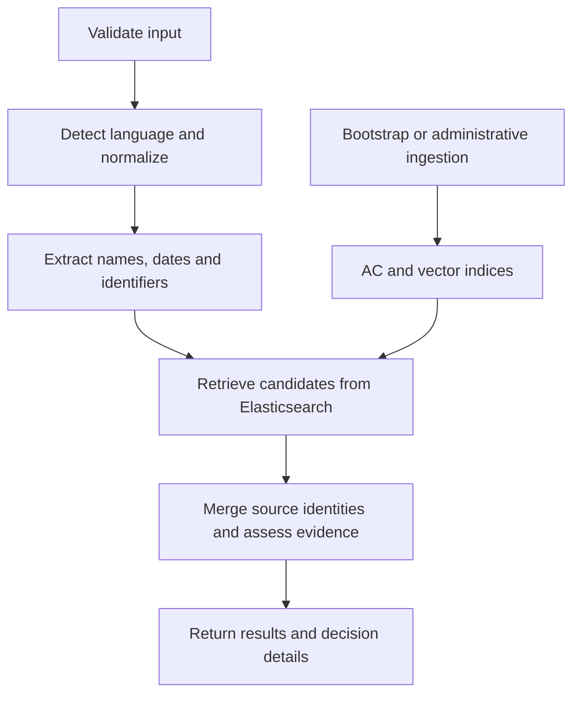

# Architecture

The HTTP application is built around one `UnifiedOrchestrator`. It coordinates
normalization, evidence extraction, retrieval and decision output; adapters own
external I/O. The same normalization service is used by the API and library.

## Pipeline

| Component | Entry point |
| --- | --- |
| HTTP routes and lifecycle | [`main.py`](../src/ai_service/main.py) |
| Pipeline coordination | [`unified_orchestrator.py`](../src/ai_service/core/unified_orchestrator.py) |
| Name normalization | [`normalization_service.py`](../src/ai_service/layers/normalization/normalization_service.py) |
| Active retrieval service | [`hybrid_search_service.py`](../src/ai_service/layers/search/hybrid_search_service.py) |
| Search settings and contracts | [`config.py`](../src/ai_service/layers/search/config.py), [`contracts.py`](../src/ai_service/layers/search/contracts.py) |
| Snapshot ingestion | [`bootstrap.py`](../src/ai_service/scripts/bootstrap.py) |

## Normalization and evidence

Supported languages are English, Russian and Ukrainian. Unicode cleanup removes
formatting controls for matching while retaining a mapping to the original text.
Evidence positions are half-open character offsets: `[start, end)` in the input.
Numeric identifiers retain leading zeroes.

The name contract preserves English middle names and ordered initials: `Mary Jane
Watson` and `John Fitzgerald Kennedy` keep their middle names; `J. Smith` stays
distinct from `A. Smith`. Initials are not expanded into invented names. Generated
variants are search alternatives, not authoritative aliases from the source list.

Dates and identifiers attach only when source spans support ownership. Unresolved
identifiers remain in `signals.extras.unassigned_ids`; conflicting birthdates leave
the selected DOB unset. An exact unassigned-ID match still requires ownership
review. A match for a different entity does not remove that requirement.

Identifier checks are separate from retrieval. A failed local checksum does not
suppress an exact source match, and a valid checksum does not establish identity
or registry membership. Pattern coverage is limited: labeled `INN 1234567890` and
a bare number can produce different extraction results.

## Retrieval and snapshot identity

The AC index supports exact, phrase and ngram retrieval. Fuzzy and tax-ID searches
scan the active index with bounded point-in-time pages and a deadline. Vector
retrieval uses the same model, preprocessing and 384-dimensional representation
as ingestion. Hybrid search combines these stages with its escalation policy.

Candidates deduplicate by **source + entity type + source ID**. Identical names
from different sources do not automatically identify the same person. Both
indices carry completion state, source metadata and a shared generation. Readiness
checks these fields; retrieval checks the generation again before publishing a
result. No local-file fallback substitutes another list during an outage.

Scores express ranking and configured evidence rules. They have no published
probabilistic calibration or population-level accuracy evaluation.

## State and concurrency

Ingestion jobs persist in SQLite under `APP_STATE_DIR`. A successful submission
returns a job ID; it is distinct from completed indexing. Writer locks coordinate
the two indices through a shared state volume on one host. Replacement is explicit
and makes screening unavailable until the new snapshot is complete.

Request, search, embedding and morphology caches are process-local. Processing
cache keys include effective feature flags and generation options. Model work uses
bounded serial queues; cancellation does not free an active native call's slot
before that call ends. HTTP admission, body size and deadlines are separately bounded.

## Runtime and compatibility

Docker installs the built wheel, packaged resources and pinned model artifacts.
The API runs as UID 10001 with a read-only root filesystem and writable volumes.
Elasticsearch is private and authenticated; a provisioning job creates the
restricted application account. Settings load at startup and require recreation
to change.

Use `ai_service` imports consistently. Active adapters use
`ai_service.layers.search.contracts`; older contracts under
`ai_service.contracts.search_contracts` remain compatibility interfaces. Retired
normalization selectors and local outage fallback are not supported. Experimental
private interfaces remain outside the [reference test selection](TESTING.md).

See [API](API.md), [Configuration](CONFIGURATION.md) and [Local operation](DEPLOYMENT.md)
for the supported interfaces.
